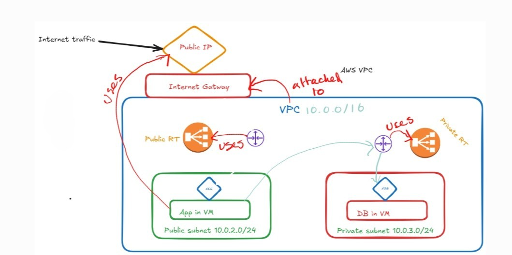
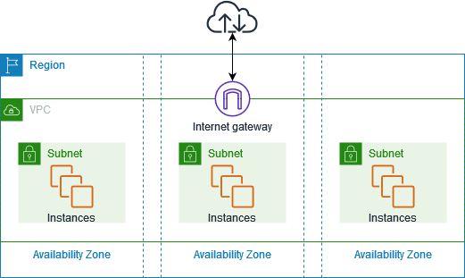

# VPC's

VPC Architecture: used to enhance security

&nbsp;

**Virtual private clouds (VPC)**

A [VPC](https://docs.aws.amazon.com/vpc/latest/userguide/configure-your-vpc.html) is a virtual network that closely resembles a traditional network that you'd operate in your own data center. After you create a VPC, you can add subnets.

****

**Subnets**

A [subnet](https://docs.aws.amazon.com/vpc/latest/userguide/configure-subnets.html) is a range of IP addresses in your VPC. A subnet must reside in a single Availability Zone. After you add subnets, you can deploy AWS resources in your VPC.

**IP addressing**

You can assign [IP addresses](https://docs.aws.amazon.com/vpc/latest/userguide/vpc-ip-addressing.html), both IPv4 and IPv6, to your VPCs and subnets. You can also bring your public IPv4 addresses and IPv6 GUA addresses to AWS and allocate them to resources in your VPC, such as EC2 instances, NAT gateways, and Network Load Balancers.

**Routing**

Use [route tables](https://docs.aws.amazon.com/vpc/latest/userguide/VPC_Route_Tables.html) to determine where network traffic from your subnet or gateway is directed.

# Why implement VPC's?

A Virtual Private Cloud (VPC) exists for one big reason: **control**.  
Cloud providers give you compute, storage, and networking, but a VPC gives *you* the power to shape the network environment those resources live in.

If you’re working with data, security, or anything that needs predictable architecture, VPCs become non‑negotiable. Let me lay it out clearly.

Why organizations implement VPCs

**1\. Isolation and security**

A VPC carves out a logically isolated section of the cloud.  
You decide:

- Which subnets are public or private
- Which resources can talk to each other
- What traffic is allowed in or out
- Whether anything touches the internet at all

It’s the cloud equivalent of having your own private data center—without the hardware headaches.

**2\. Fine‑grained network control**

You can control:

- IP ranges
- Routing tables
- NAT gateways
- Firewalls (security groups, NACLs)

This lets you design architectures that match your application’s needs instead of being boxed into a default network.

**3\. Compliance and governance**

Industries like finance, healthcare, and insurance often *must* isolate workloads.  
A VPC helps meet requirements around:

- Data residency
- Segmentation
- Access control
- Auditability

It’s a foundational piece for regulated environments.

**4\. Hybrid connectivity**

If you need to connect cloud resources to:

- On‑prem systems
- Corporate networks
- VPNs
- Direct Connect / ExpressRoute

It becomes the bridge between your existing infrastructure and the cloud.

**5\. Performance and reliability**

By controlling subnets and routing, you can:

- Reduce latency
- Keep traffic internal
- Avoid unnecessary hops
- Architect for high availability

This matters when you’re building distributed systems or data pipelines.

**6\. Multi‑tier application design**

A VPC lets you separate:

- Web tier (public)
- App tier (private)
- Database tier (isolated private)

This is the backbone of secure, scalable architectures.

# What are CIDR Blocks?

CIDR stands for Classless Inter‑Domain Routing. A CIDR block is simply a **range of IP addresses** written in a compact, structured way.

**Why CIDR matters in VPC design**

1\. You control IP allocation

You decide how big your VPC is and how many subnets you can carve out.

Example:  
A VPC with `10.0.0.0/16` can be split into 256 `/24` subnets.

2\. Avoiding overlap

If you connect:

- VPC ↔ on‑prem
- VPC ↔ VPC
- VPC ↔ partner network

you must avoid overlapping CIDR blocks or routing breaks.

3\. Efficient segmentation

CIDR lets you create; Public subnets, Private subnets, Isolated subnets, Multi‑AZ architectures. All without wasting IP space.

4\. Security boundaries

Security groups and NACLs often reference CIDRs directly:

Allow inbound from 10.0.1.0/24  
Deny outbound to 0.0.0.0/0
